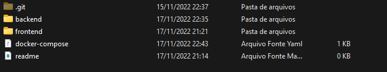
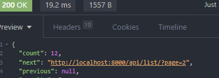
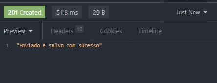
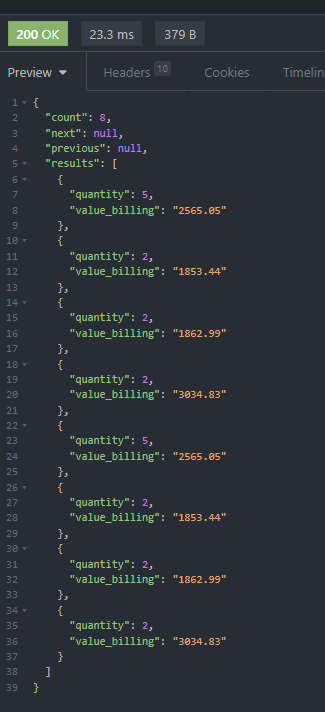
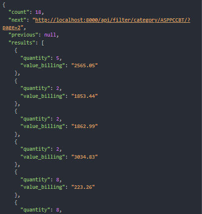
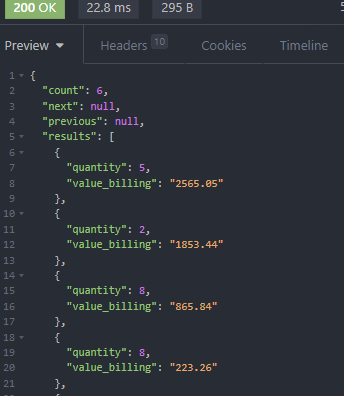
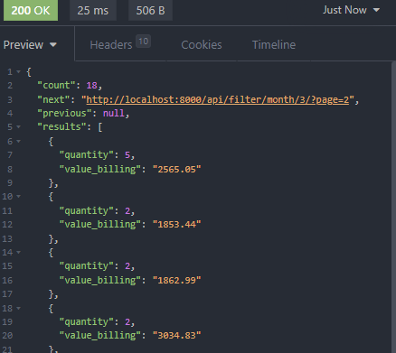
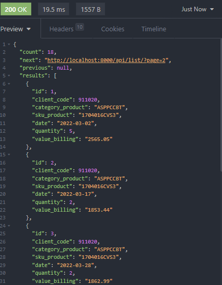

# Passos iniciais para rodar o projeto

* Para rodar o projeto é necessário ter o Docker instalado na máquina, caso não tenha [Clique aqui](https://docs.docker.com/desktop/install/windows-install/) para baixar .
* Dentro da pasta backend existe um arquivo com o nome .env.example, crie um novo arquivo chamado .env e copie as informações do .env.example para sua segurança pode colocar os dados de login e nome do database como preferir
* Após os passos acima volte para a a pasta raiz aonde encontrará a seguinte estrutura

  
* Abra o terminal na pasta e execute o comando ***docker-compose up*** que irá criar os containers do frontend e do backend (O front-end roda na porta 3000, o banco de dados na porta 5432 e a api na porta 8000, certifique-se de não ter nenhuma aplicação rodando nas portas citadas)
* Após finalizar o comando **docker-compose up** as devidas aplicações estarão funcionando e você poderá testar
* Para acessar a aplicação web ->  [http://localhost:3000/](http://localhost:3000/)

# Endpoints da API

A Api conta com paginacao de 10 itens por página e cabeçalho contendo as páginas anterioes e sucessoras:
	

A Api possuios seguintes endpoints:

* ***POST***  /uploads/  --->  Feita para o envio do arquivo, Resposta de sucesso:

* ***GET***  /filter/product/{código do produto}/ --> filtragem pelo código do produto,Resposta da busca:

* ***GET***  /filter/category/{categoria do produto}/ --> filtragem pelo codigo da categoria do produto, Resposta da busca:

* ***GET***      /filter/client/{código do cliente}/ --> filtragem pelo código do cliente, Resposta da busca:

* ***GET***  /filter/month/{ número do mês }/ --> filtragem pelo mes selecionado, Resposta da busca:

* **GET** /list/ --> listagem de todos os dados inseridos no banco de dados, Resposta da busca:

* ***GET***  /quarterly/{ numero do trimestre }/ --> filtragem dos dados por trimeste(opções 1 - 4), Resposta da busca:
  

# Tecnologias usadas

### Frontend

- ReactJS
- Typescript
- Styled-components
- Axios
- Sass
- Apex-charts
- React-datepicker
- React-icons
- Radix UI

### Backend

- Django rest framework (Python)
- PostgreSQL

### Outras tecnologias utilizadas

- Docker
